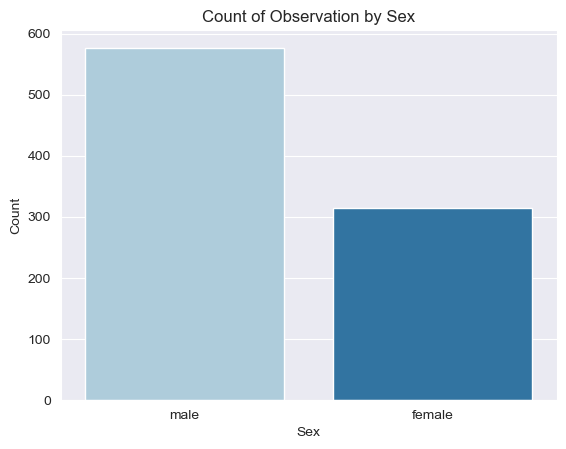
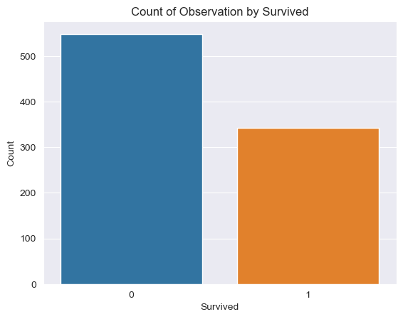
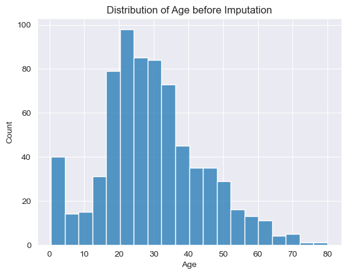
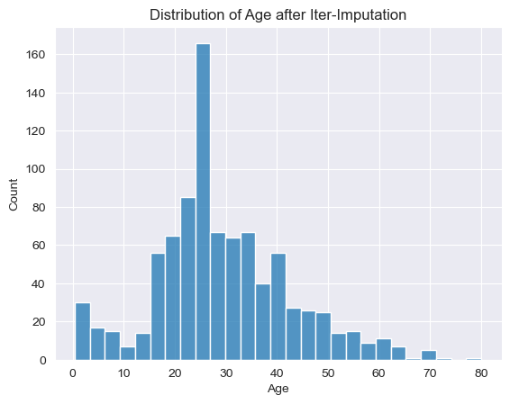

# Titanic - Machine Learning from Disaster

More Information on: [Kaggle](https://www.kaggle.com/competitions/titanic/overview)


```python
import pandas as pd
import numpy as np
import seaborn as sns
import matplotlib.pyplot as plt
from sklearn.experimental import enable_iterative_imputer
from sklearn.impute import IterativeImputer
from sklearn.impute import KNNImputer
from sklearn.preprocessing import StandardScaler
from sklearn.ensemble import RandomForestClassifier, GradientBoostingClassifier
from sklearn.linear_model import LogisticRegression
from sklearn.linear_model import LinearRegression
from sklearn.linear_model import Ridge
from sklearn.linear_model import Lasso
from sklearn.model_selection import GridSearchCV
from sklearn.model_selection import RandomizedSearchCV
from sklearn.svm import SVC
from scipy.stats import uniform
import pickle


```

## Import train set


```python
data = pd.read_csv("train.csv")
test_data = pd.read_csv("test.csv")
gender = pd.read_csv("gender_submission.csv")
data.head()
```


<div>
<style scoped>
    .dataframe tbody tr th:only-of-type {
        vertical-align: middle;
    }

    .dataframe tbody tr th {
        vertical-align: top;
    }

    .dataframe thead th {
        text-align: right;
    }
</style>
<table border="1" class="dataframe">
  <thead>
    <tr style="text-align: right;">
      <th></th>
      <th>PassengerId</th>
      <th>Survived</th>
      <th>Pclass</th>
      <th>Name</th>
      <th>Sex</th>
      <th>Age</th>
      <th>SibSp</th>
      <th>Parch</th>
      <th>Ticket</th>
      <th>Fare</th>
      <th>Cabin</th>
      <th>Embarked</th>
    </tr>
  </thead>
  <tbody>
    <tr>
      <th>0</th>
      <td>1</td>
      <td>0</td>
      <td>3</td>
      <td>Braund, Mr. Owen Harris</td>
      <td>male</td>
      <td>22.0</td>
      <td>1</td>
      <td>0</td>
      <td>A/5 21171</td>
      <td>7.2500</td>
      <td>NaN</td>
      <td>S</td>
    </tr>
    <tr>
      <th>1</th>
      <td>2</td>
      <td>1</td>
      <td>1</td>
      <td>Cumings, Mrs. John Bradley (Florence Briggs Th...</td>
      <td>female</td>
      <td>38.0</td>
      <td>1</td>
      <td>0</td>
      <td>PC 17599</td>
      <td>71.2833</td>
      <td>C85</td>
      <td>C</td>
    </tr>
    <tr>
      <th>2</th>
      <td>3</td>
      <td>1</td>
      <td>3</td>
      <td>Heikkinen, Miss. Laina</td>
      <td>female</td>
      <td>26.0</td>
      <td>0</td>
      <td>0</td>
      <td>STON/O2. 3101282</td>
      <td>7.9250</td>
      <td>NaN</td>
      <td>S</td>
    </tr>
    <tr>
      <th>3</th>
      <td>4</td>
      <td>1</td>
      <td>1</td>
      <td>Futrelle, Mrs. Jacques Heath (Lily May Peel)</td>
      <td>female</td>
      <td>35.0</td>
      <td>1</td>
      <td>0</td>
      <td>113803</td>
      <td>53.1000</td>
      <td>C123</td>
      <td>S</td>
    </tr>
    <tr>
      <th>4</th>
      <td>5</td>
      <td>0</td>
      <td>3</td>
      <td>Allen, Mr. William Henry</td>
      <td>male</td>
      <td>35.0</td>
      <td>0</td>
      <td>0</td>
      <td>373450</td>
      <td>8.0500</td>
      <td>NaN</td>
      <td>S</td>
    </tr>
  </tbody>
</table>
</div>


```python
data.info()
```

    <class 'pandas.core.frame.DataFrame'>
    RangeIndex: 891 entries, 0 to 890
    Data columns (total 12 columns):
     #   Column       Non-Null Count  Dtype  
    ---  ------       --------------  -----  
     0   PassengerId  891 non-null    int64  
     1   Survived     891 non-null    int64  
     2   Pclass       891 non-null    int64  
     3   Name         891 non-null    object 
     4   Sex          891 non-null    object 
     5   Age          714 non-null    float64
     6   SibSp        891 non-null    int64  
     7   Parch        891 non-null    int64  
     8   Ticket       891 non-null    object 
     9   Fare         891 non-null    float64
     10  Cabin        204 non-null    object 
     11  Embarked     889 non-null    object 
    dtypes: float64(2), int64(5), object(5)
    memory usage: 83.7+ KB
    

## EDA


```python
# check for missing values
data.isna().sum()
```


    PassengerId      0
    Survived         0
    Pclass           0
    Name             0
    Sex              0
    Age            177
    SibSp            0
    Parch            0
    Ticket           0
    Fare             0
    Cabin          687
    Embarked         2
    dtype: int64


```python
#Set qualitative color palette
colors = sns.color_palette("Paired")

# Plot Count of Sex
sns.countplot(data=data, x="Sex", palette=colors)
plt.title("Count of Observation by Sex")
plt.ylabel("Count")
plt.show()
plt.close()
```


    

    


```python
sns.countplot(data=data, x="Survived")
plt.title("Count of Observation by Survived")
plt.ylabel("Count")
plt.show()
```


    

    


```python
sns.histplot(data=data, x="Age")
plt.title("Distribution of Age before Imputation")
plt.show()
```


    

    


## Impuation

Now we want to impute the missing age values with `IterativeImputer`. It comes with several estimator. The choice of the estimator depends on our data and the characteristics of the age variable.

- 'bayesian_ridge': Bayesian ridge regression model
- 'decision_tree': Single decision tree regressor
- 'extra_trees': Ensemble of randomized extra-trees regressors
- 'knn': K-nearest neighbors regressor
- 'linear': Linear regression model
- 'mlp': Multi-layer perceptron neural network regressor
- 'random_forest': Ensemble of randomized decision trees (Random Forest) regressor
- 'ridge': Ridge regression model
- 'svr': Support vector regression model


```python
features = data.drop(columns=["Name", "Ticket", "PassengerId", "Survived", "Cabin", "Embarked", "SibSp", "Parch", "Fare"], axis=1)


test_features = test_data.drop(columns=["Name", "Ticket", "PassengerId", "Cabin", "Embarked", "SibSp", "Parch", "Fare"], axis=1)

label = data.Survived
```


```python
features.Sex = features.Sex.map({"male":1, "female": 0})
test_features.Sex = test_features.Sex.map({"male":1, "female": 0})
features.head()
```


<div>
<style scoped>
    .dataframe tbody tr th:only-of-type {
        vertical-align: middle;
    }

    .dataframe tbody tr th {
        vertical-align: top;
    }

    .dataframe thead th {
        text-align: right;
    }
</style>
<table border="1" class="dataframe">
  <thead>
    <tr style="text-align: right;">
      <th></th>
      <th>Pclass</th>
      <th>Sex</th>
      <th>Age</th>
    </tr>
  </thead>
  <tbody>
    <tr>
      <th>0</th>
      <td>3</td>
      <td>1</td>
      <td>22.0</td>
    </tr>
    <tr>
      <th>1</th>
      <td>1</td>
      <td>0</td>
      <td>38.0</td>
    </tr>
    <tr>
      <th>2</th>
      <td>3</td>
      <td>0</td>
      <td>26.0</td>
    </tr>
    <tr>
      <th>3</th>
      <td>1</td>
      <td>0</td>
      <td>35.0</td>
    </tr>
    <tr>
      <th>4</th>
      <td>3</td>
      <td>1</td>
      <td>35.0</td>
    </tr>
  </tbody>
</table>
</div>


```python
imp_iter = IterativeImputer(max_iter=10, random_state=42)
features_imp = imp_iter.fit_transform(features)

features_imp = pd.DataFrame(features_imp, columns=features.columns)

```


```python
features_imp.isna().sum()
```


    Pclass    0
    Sex       0
    Age       0
    dtype: int64


```python
test_features.isna().sum()
```


    Pclass     0
    Sex        0
    Age       86
    dtype: int64


```python
sns.histplot(data=features_imp, x="Age")
plt.title("Distribution of Age after Iter-Imputation")
```


    Text(0.5, 1.0, 'Distribution of Age after Iter-Imputation')


    

    


```python
np.min(features_imp.Age)
```


    0.42


We got negative values for age which just is impossible. So we use another Imputation Strategy like `KNNImputer`


```python
knn_imp = KNNImputer(n_neighbors=3)

features_knn = knn_imp.fit_transform(features)
features_knn = pd.DataFrame(features_knn, columns=features.columns)

test_features_knn = knn_imp.fit_transform(test_features)
test_features_knn = pd.DataFrame(test_features_knn, columns=test_features.columns)

features_knn.head()

```


<div>
<style scoped>
    .dataframe tbody tr th:only-of-type {
        vertical-align: middle;
    }

    .dataframe tbody tr th {
        vertical-align: top;
    }

    .dataframe thead th {
        text-align: right;
    }
</style>
<table border="1" class="dataframe">
  <thead>
    <tr style="text-align: right;">
      <th></th>
      <th>Pclass</th>
      <th>Sex</th>
      <th>Age</th>
    </tr>
  </thead>
  <tbody>
    <tr>
      <th>0</th>
      <td>3.0</td>
      <td>1.0</td>
      <td>22.0</td>
    </tr>
    <tr>
      <th>1</th>
      <td>1.0</td>
      <td>0.0</td>
      <td>38.0</td>
    </tr>
    <tr>
      <th>2</th>
      <td>3.0</td>
      <td>0.0</td>
      <td>26.0</td>
    </tr>
    <tr>
      <th>3</th>
      <td>1.0</td>
      <td>0.0</td>
      <td>35.0</td>
    </tr>
    <tr>
      <th>4</th>
      <td>3.0</td>
      <td>1.0</td>
      <td>35.0</td>
    </tr>
  </tbody>
</table>
</div>


```python
sns.histplot(features_knn, x="Age")
plt.title("Distribution of Age after KNN-Impuation")
plt.show()
```


```python
np.min(features_knn.Age)
```


```python
corr_matrix = features_knn.corr()
```


```python
sns.heatmap(corr_matrix, annot=True, cmap="mako")
plt.show()
```

Apart from the variables Fare and Pclass, the variables do not seem to correlate with each other. So we could decide for a regression or classification.

## Standardize Data


```python
scaler = StandardScaler()
features_knn_scaled = scaler.fit_transform(features_knn)
test_features_knn_scaled = scaler.fit_transform(test_features_knn)
```

## LogisticRegression()


```python
lr = LogisticRegression()
lr.fit(features_knn_scaled, label)
print(lr.score(features_knn_scaled, label))
```


```python
## LinearRegression()
```


```python
linear = LinearRegression()
linear.fit(features_knn_scaled, label)
print(linear.score(features_knn_scaled, label))

print("Intercept:", linear.intercept_)
print("Coefficients:", linear.coef_)

```


```python
## Lasso
```


```python
lasso = Lasso()
lasso.fit(features_knn_scaled, label)
print(lasso.score(features_knn_scaled, label))
```

## Ridge


```python
ridge = Ridge()
ridge.fit(features_knn_scaled, label)
print(ridge.score(features_knn_scaled, label))
```


```python

```


```python
## RandomForest
```


```python
rf = RandomForestClassifier(random_state=42)
rf.fit(features_knn, label)

# Definieren Sie den Hyperparameterraum, den Sie untersuchen möchten
param_grid = {
    'n_estimators': [100, 200, 500],
    'max_depth': [5, 10, 20],
    'min_samples_split': [2, 5, 10],
    'min_samples_leaf': [1, 2, 4],
    'max_features': ['sqrt', 'log2']
}

# Definieren Sie den GridSearchCV-Algorithmus mit Kreuzvalidierung
gs_rf = GridSearchCV(rf, param_grid, cv=5, n_jobs=-1)
gs_rf.fit(features_knn, label)
prediction_gs_rf = gs_rf.predict(test_features_knn)

# Zeigen Sie die besten Hyperparameter und den entsprechenden Score an
print("Best parameters found: ", gs_rf.best_params_)
print("Best score: ", gs_rf.best_score_)

print(gs_rf.score(features_knn, label))
```


```python
print('Random Forest base parameters', rf.get_params())
```

## GradientBoostingClassifier


```python
grad_classifier = GradientBoostingClassifier()

learning_rate_list = [0.001, 0.01, 0.05, 0.1, 0.2]

param_grid = {'learning_rate': learning_rate_list,
              'n_estimators': [400, 500],
              'max_depth': [3, 5],
              'min_samples_split': [2, 3],
              'subsample': [0.3, 0.5, 0.7]}

gs = GridSearchCV(grad_classifier, param_grid=param_grid, cv=5, scoring="accuracy", verbose=True)

gs.fit(features_knn, label)

best_learning_rate = gs.best_params_["learning_rate"]
print(best_learning_rate)

print("Best Params: ", gs.best_params_)

print(gs.score(features_knn, label))
predictions_boost = gs.predict(test_features_knn)


```


```python
#print("Best Params: ", gs.best_params_)
```


```python
param_grid = {
    "C": [0.1, 1,2,3,4, 10],
    "gamma": [0.01, 0.1,0.2, 1]
}

clf = SVC()
gs_clf = GridSearchCV(estimator=clf, param_grid=param_grid, cv=5)
gs_clf.fit(features_knn_scaled, label)
predictions_gs_clf = gs_clf.predict(test_features_knn_scaled)

print(gs_clf.score(features_knn_scaled, label))
print("Best params: ", gs_clf.best_params_)
```


```python
# Definiere die Parameter, die getestet werden sollen
param_dist = {
    'C': uniform(0, 10),
    'gamma': ['scale', 'auto'] + list(uniform(0, 5).rvs(8)),
    'kernel': ['rbf', 'sigmoid']
}

# Erstelle ein SVM-Modell
svc = SVC()

# Erstelle einen RandomizedSearchCV-Objekt
rs = RandomizedSearchCV(estimator=svc, param_distributions=param_dist, n_iter=200, cv=5, random_state=42)

# Führe den Randomized Search durch
rs.fit(features_knn_scaled, label)
predictions_rs = rs.predict(test_features_knn_scaled)

# Gib die besten Parameter aus
print("Beste Parameter: ", rs.best_params_)
print("Bestes Score: ", rs.best_score_)
```


```python
output = pd.DataFrame({'PassengerId': test_data.PassengerId, 'Survived': predictions_rs})
output.to_csv('submission.csv', index=False)
print("Your submission was successfully saved!")
```


```python
# Support Vektor Machine
with open('rs_model.pkl', 'wb') as file:
    pickle.dump(rs, file)
```


```python
# GradientBoosterClassifier
with open('gs_model.pkl', 'wb') as file:
    pickle.dump(gs, file)
```
